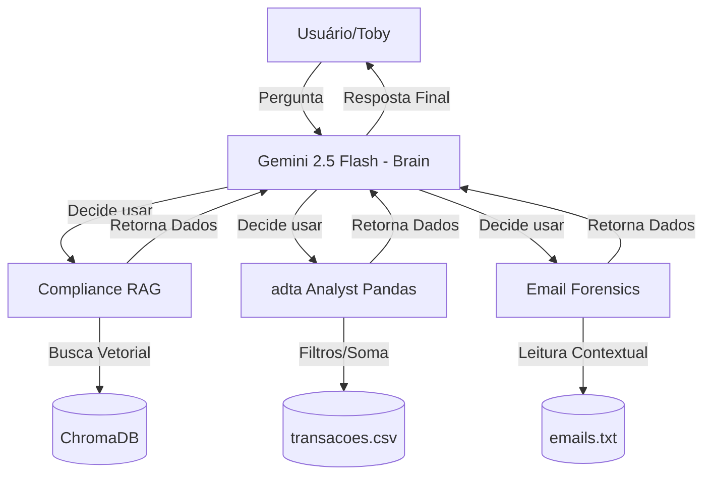

# Dunder Mifflin Auditor
Ana Beatriz Passos Beggiato - EC08 dez/2025

## Funcionalidades

O sistema foi desenhado para superar os 4 níveis de complexidade propostos pelo desafio:

1.  **Especialista em Compliance (RAG):**
    * Utiliza *Retrieval-Augmented Generation* (RAG) com ChromaDB para consultar a política interna da empresa e responder dúvidas sobre leis e limites de gastos.
2.  **Investigação Forense (E-mails):**
    * Analisa o *dump* de e-mails para identificar sentimentos, conspirações (Michael vs. Toby) e intenções de fraude.
3.  **Auditoria Financeira (Análise de Dados):**
    * **Nível Básico:** Verifica limites e categorias na planilha de gastos (`transacoes_bancarias.csv`).
    * **Nível Avançado (Fraude Cruzada):** Capacidade de raciocínio complexo para ler um e-mail suspeito (ex: combinação de desvio) e verificar na planilha se a transação financeira correspondente ocorreu.

---

## Arquitetura do Sistema

O projeto utiliza o padrão de **Orquestrador de Ferramentas**. O modelo Gemini 2.5 Flash atua como o "cérebro" que decide qual ferramenta Python executar com base na pergunta do usuário.



## Tecnologias Utilizadas
- Linguagem: Python 3.10+
- LLM: Google Gemini 2.5 Flash (via google-generativeai)
- Vector Store: ChromaDB (para o RAG)
- Análise de Dados: Pandas
- Ambiente: Dotenv (gerenciamento de variáveis)

## Como Rodar o Projeto
Pré-requisitos
- Python instalado.
- Uma chave de API do Google AI Studio.

### Passo a Passo
1. Clone o repositório:
```bash
git clone https://github.com/anabeggiato/dunder-mifflin-auditor.git
cd dunder-mifflin-auditor
```

2. Crie e ative o ambiente virtual
```bash
# Windows
python -m venv venv
venv\Scripts\activate

# Linux/Mac
python3 -m venv venv
source venv/bin/activate
```

3. Instale as dependencias
```bash
pip install -r requirements.txt
```

4. Configure a API Key
- Renomeie o arquivi <code>.env.sample</code> para <code>.env</code>
- Adicione sua chave:
```
GOOGLE_API_KEY=sua_chave
```

5. Execute o auditor:
```
python3 main.py
```

## Estrutura do projeto
```
dunder-mifflin-auditor/
│
├── data/                  # Arquivos fornecidos (csv, txt)
├── src/                   # Código fonte das ferramentas
│   ├── compliance_rag.py  # Lógica do RAG com ChromaDB
│   ├── data_analyst.py    # Análise de dados com Pandas
│   └── email_forensics.py # Leitura de e-mails
├── main.py                # Orquestrador principal (Gemini)
├── requirements.txt       # Dependências
├── README.md              # Documentação
└── .env                   # Chave de API
```

## Vídeo de explicação
Acesse o vídeo clicando [aqui](https://drive.google.com/file/d/1gIe1SMT5U_RedH37zsyc3_fpAijjxZxX/view?usp=sharing)